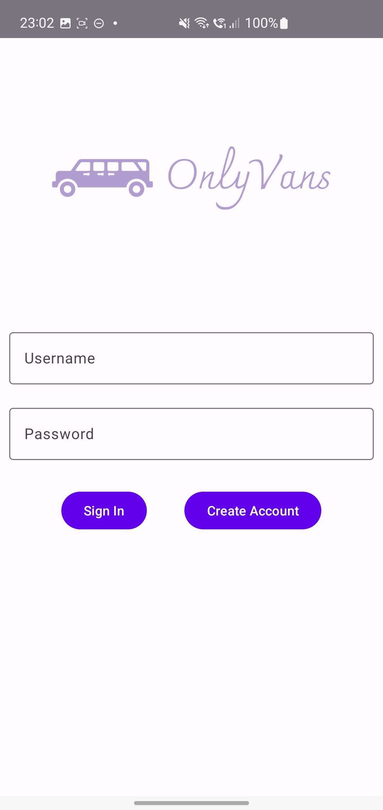
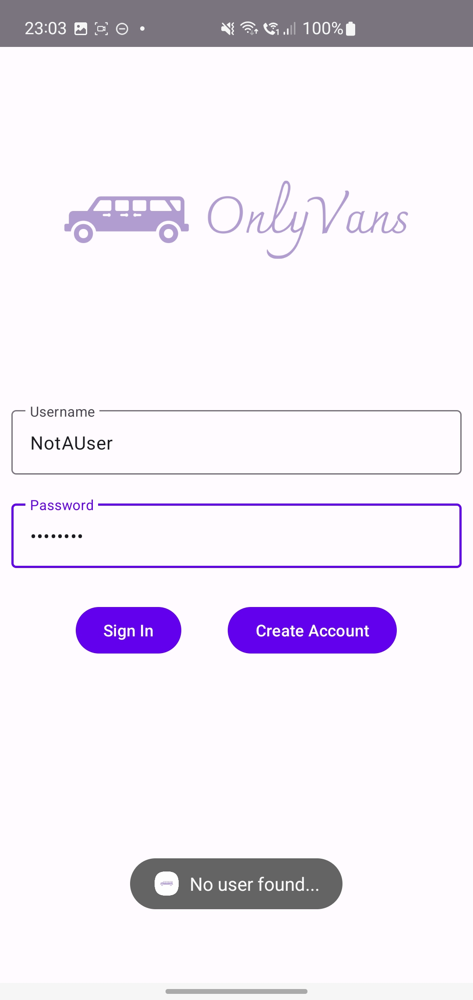
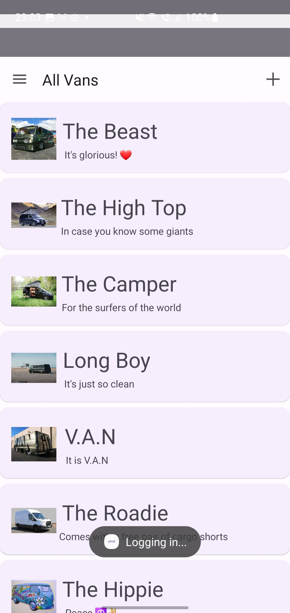
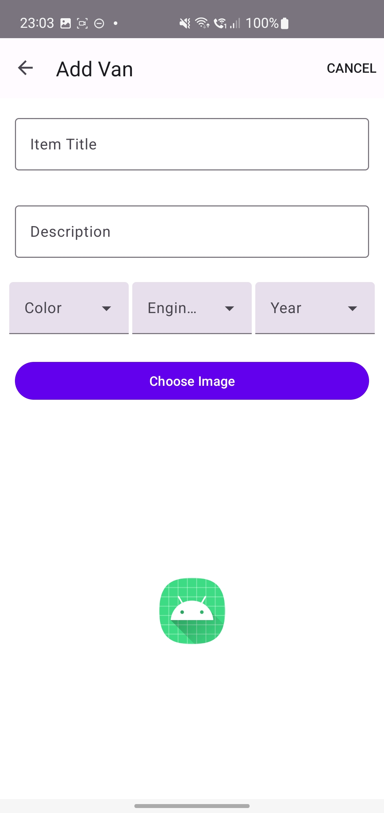
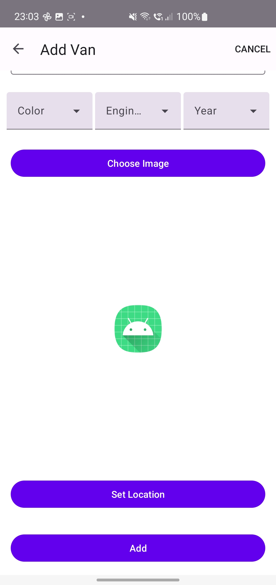
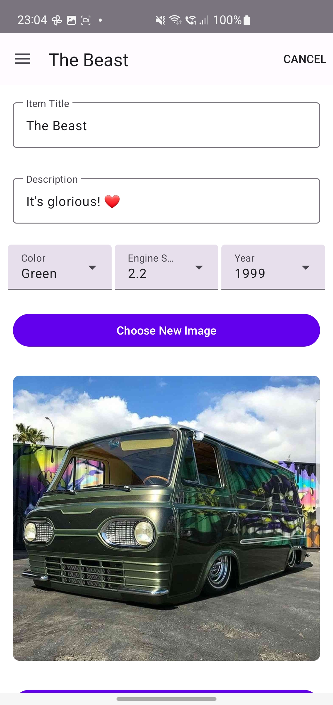
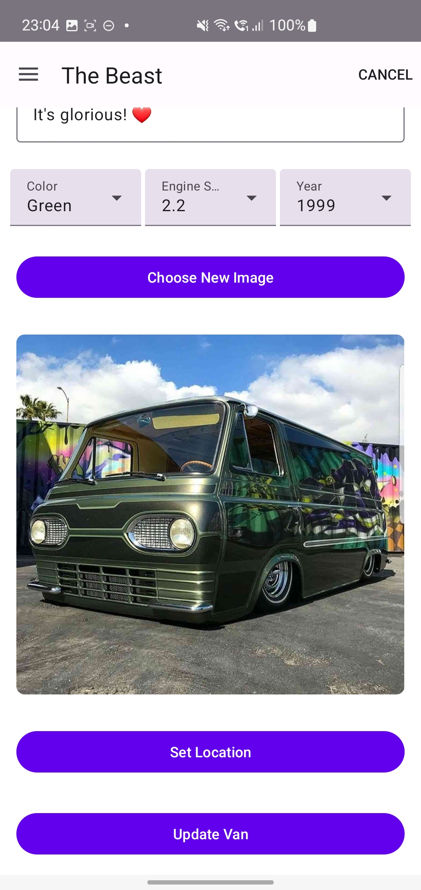
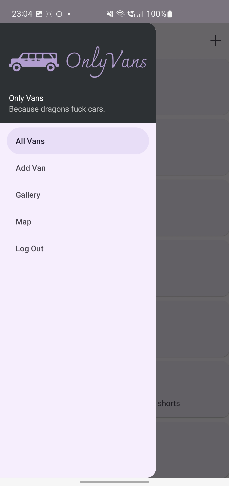
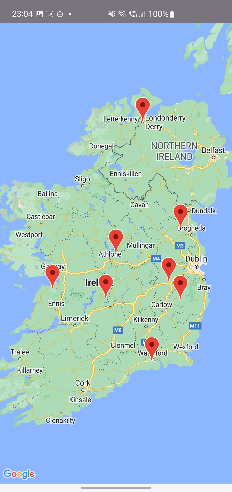

# Only Vans
### _Everyone loves a nice van._

Only Vans is an Android application developed in Kotlin, using Material 3 UI elements. It is designed with van fans in mind, allowing the user to add, edit, and track location of vans. Great!

## Features

- User account registration
- Add/Edit vans, including details such as engine size, color and year of manufacture
- Add an image, which is persisted in local storage
- List all vans with a preview, and **click to edit** or **swipe to delete**
- Add/Update location information for vans, which can be viewed on a global map

## Screenshots

